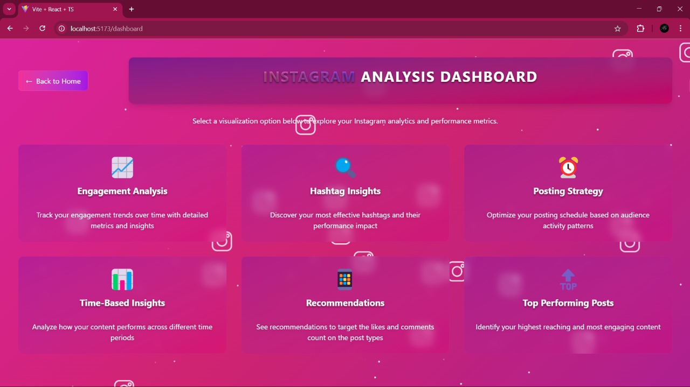
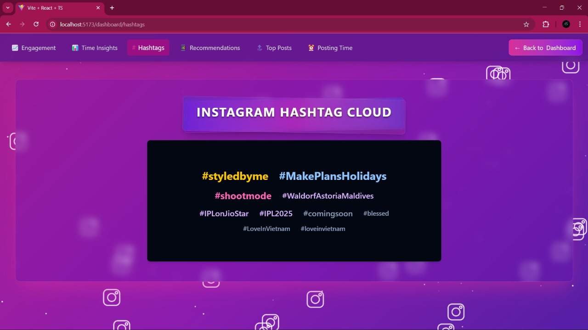
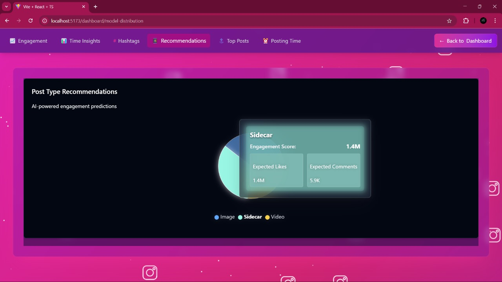
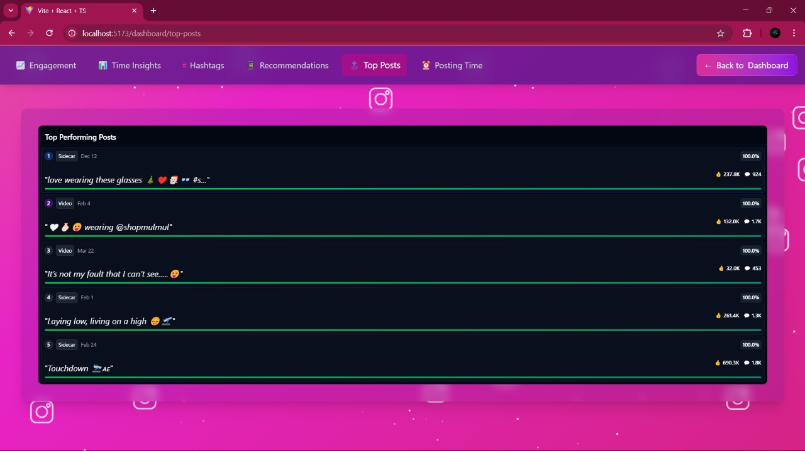
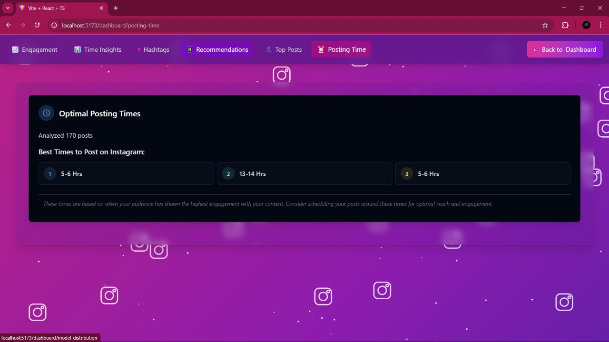

# Insta Post Analysis Using ML for Trend Prediction

This project uses machine learning to analyze Instagram post data and predict engagement trends. By examining factors like captions, posting time, likes, comments, and reach, the model identifies patterns that influence content performance. It leverages a stacked regression approach combining XGBoost, Random Forest, and meta-models to provide accurate predictions with an average R² score of 0.87.

The system is backed by Astra DB for data storage and includes an API for serving predictions. This tool is designed to help creators, marketers, and analysts optimize their Instagram content strategy based on data-driven insights.


## Features

-  Analyze post performance based on content and posting time
- Predict likes, comments, and reach using a stacked regression model
- Identify top-performing posts and engagement trends
- Discover the best times to post for maximum interaction
- Data stored and processed with Astra DB
    
## Run Locally

Clone the project

```bash
  gh repo clone Shravani804/Instagram-Trend-and-Post-Analysis
```

Go to the project directory

```bash
  cd Instagram-Trend-and-Post-Analysis
```


## Installation

### Its preferred to operate backend, frontend and models in different terminals.

For backend 
```bash
  cd backend/
  npm install
```

For frontend 
```bash
  cd frontend/
  npm install
```
For models
```bash
  cd backend/ml_models/
  pip install -r requirements.txt
```
## Running the project

Start the frontend/client
```bash
  npm run dev
```

Start the server

```bash
  npm run dev
```
To run models
```bash
  python model_endpoints.py 
```


## Screenshots
<!--






 -->

<!-- 1st image displayed alone -->
## Screenshots

### Main Screenshot
<p align="center">
  
</p>
<p align="center">
  
  
  
</p>
<p align="center">
  
  
  
</p>


## Tech Stack

**Frontend:** React, TypeScript, Next.js

**Backend:** JavaScript (Node.js), FastAPI, Python(models)

**ML Models:** Pandas, NumPy, Scikit-learn, FastAPI 

**Database:** Astra DB (Cassandra-based NoSQL DB) 


## Acknowledgements

 - [Datastax Astra Database](https://astra.datastax.com/)
 - [Google Colab Notebook](https://colab.research.google.com/)
 - [Apify](https://apify.com/)

